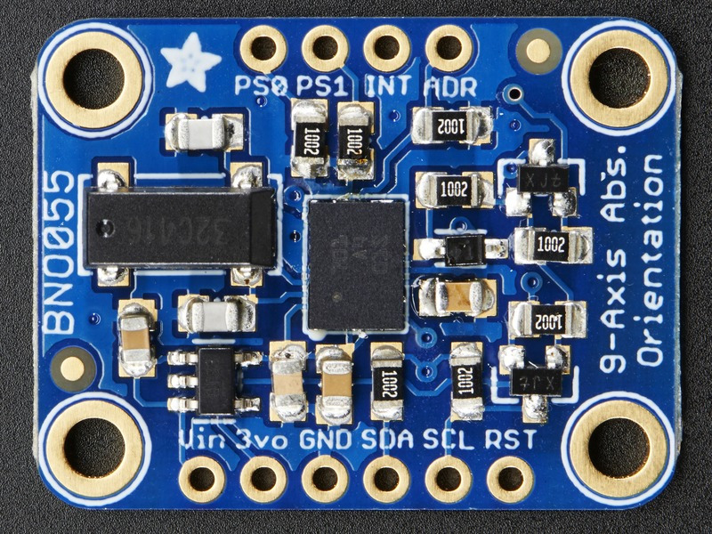
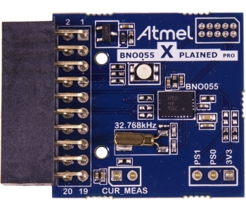

# BNO055_FRC

A test project to illustrate how to use the BNO055 sensor ([datasheet pdf] (http://www.adafruit.com/datasheets/BST_BNO055_DS000_12.pdf)) with the FRC control system.

This code is a port of the [Adafruit BNO055 arduino library](https://github.com/adafruit/Adafruit_BNO055/blob/master/Adafruit_BNO055.cpp).
At the time of writing, this sensor was available from:
 - $35 + S/H: [Adafruit](http://www.adafruit.com/product/2472)
 - $35 + S/H: [digikey](http://www.digikey.com/product-detail/en/2472/1528-1426-ND/5699182)
 - $40 + $3 S/H (prime eligible): [Amazon](http://www.amazon.com/Adafruit-Absolute-Orientation-Fusion-Breakout/dp/B017PEIGIG)
 - $21 + S/H: The Atmel breakout board at [digikey](http://www.digikey.com/product-detail/en/ATBNO055-XPRO/ATBNO055-XPRO-ND/5230918) will likely also work (untested). - Sparse documentation ([pdf](http://www.atmel.com/Images/BNO055_Xplained_pro_design_documentation.pdf))

##Wiring
The demo code assumes you've wired the sensor to the I2C port on the roboRio, just below the CAN connector. All pins on the roboRio side are on the I2C port.

roboRio Pin (I2C header) | Adafruit Breakout Board Pin | Atmel Breakout Board Pin 
-------------------------|-----------------------------|--------------------------
3.3V                     | Vin                         | 20
GND                      | GND                         | 19
SDA                      | SDA                         | 11
SCL                      | SCL                         | 12
                         |                             | Also connect pin 5 to GND (to set I2C address to 0x28).

More information on the pinouts for the BNO055 breakout boards can be found here:
 - [Adafruit](https://learn.adafruit.com/adafruit-bno055-absolute-orientation-sensor/pinouts)
 - Atmel [pdf](http://www.atmel.com/Images/BNO055_Xplained_pro_design_documentation.pdf)

##Video Demos
Coming soon.
